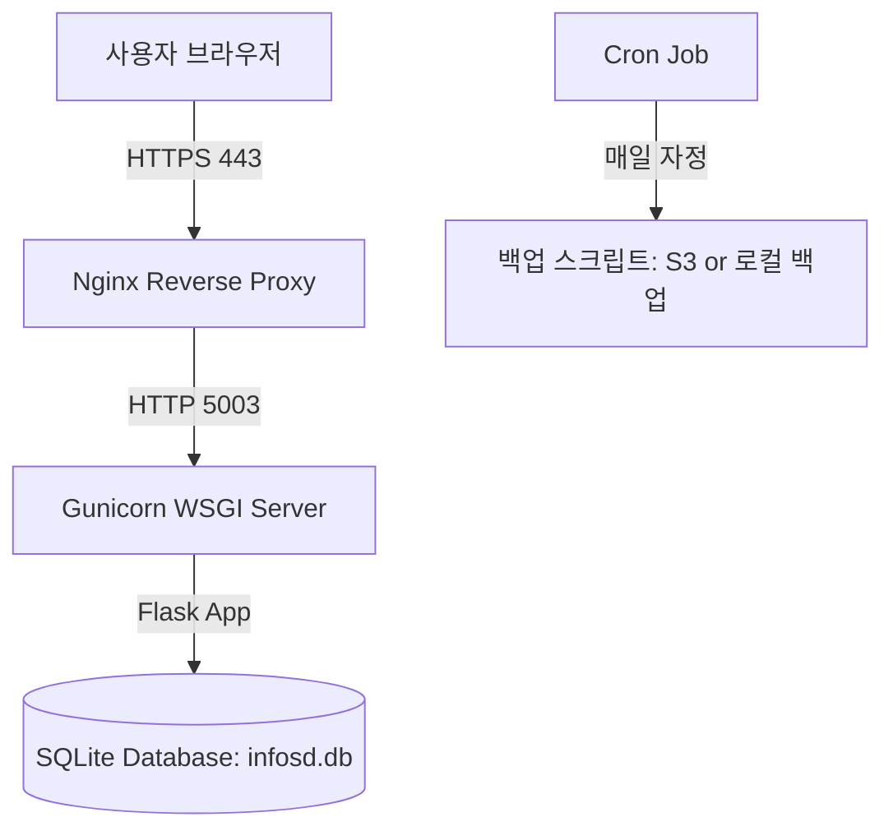

# infosd 운영 서버 배포 가이드 (Production Deployment Guide)

본 가이드는 SQLite 데이터베이스 환경을 유지하면서 Flask 애플리케이션을 안정적으로 운영 서버에 배포하기 위한 환경 설정 및 구성 방법을 안내합니다.

---

## 1. 시스템 아키텍처 개요



- **웹 서버 / 리버스 프록시**: Nginx (SSL/HTTPS 처리 및 정적 파일 서빙)
- **WSGI HTTP 서버**: Gunicorn (Flask 애플리케이션 프로세스 관리)
- **데이터베이스**: SQLite (`infosd.db`, 안전한 로컬 디렉토리에 위치)
- **백업**: `sqlite3` CLI 내장 온라인 백업 기능(`.backup`)을 활용한 매일 자동 백업

---

## 2. 필수 패키지 설치

운영 서버 환경(Ubuntu/Debian 기준)에서 필요한 패키지를 설치합니다.

```bash
# 시스템 패키지 업데이트 및 설치
sudo apt update && sudo apt install -y nginx python3-pip python3-venv sqlite3 cron

# Gunicorn 설치 (가상환경 내 또는 글로벌 설치)
pip install gunicorn
```

---

## 3. 환경 변수 설정 (`/home/user/infosd/.env`)

운영 환경에 맞는 민감 정보 및 경로 설정을 정의합니다.

```bash
# .env.production 파일 예시
FLASK_ENV=production
infosd_PORT=5003
infosd_SECRET_KEY="지극히-안전하고-복잡한-세션-키로-변경하십시오"
infosd_DB_PATH="/var/lib/infosd/database/infosd.db"
```

> [!IMPORTANT]
> `infosd_DB_PATH`는 애플리케이션 소스 코드 디렉토리 외부의 안전한 경로(예: `/var/lib/infosd/database/`)로 지정하여, 배포 시 데이터베이스 파일이 덮어써지거나 유실되는 것을 방지합니다.

---

## 4. Systemd 서비스 구성 (`/etc/systemd/system/infosd.service`)

Flask 앱이 서버 부팅 시 자동 시작되고 프로세스가 다운되었을 때 자동 재시작되도록 Systemd 서비스로 등록합니다.

```ini
[Unit]
Description=infosd Flask Application Service
After=network.target

[Service]
User=ubuntu
Group=ubuntu
WorkingDirectory=/home/ubuntu/Dev/pythons/infosd
EnvironmentFile=/home/ubuntu/Dev/pythons/infosd/.env
ExecStart=/home/ubuntu/Dev/pythons/infosd/.venv/bin/gunicorn -w 4 -b 127.0.0.1:5003 infosd:app --access-logfile /home/ubuntu/Dev/pythons/infosd/logs/access.log --error-logfile /home/ubuntu/Dev/pythons/infosd/logs/error.log

Restart=always
RestartSec=5

[Install]
WantedBy=multi-user.target
```

```bash
# 서비스 활성화 및 시작
sudo systemctl daemon-reload
sudo systemctl enable infosd
sudo systemctl start infosd
sudo systemctl status infosd
```

---

## 5. Nginx 리버스 프록시 설정 (`/etc/nginx/sites-available/infosd`)

클라이언트의 요청을 Gunicorn으로 전달하고, SSL 적용 및 정적 파일 캐싱을 적용합니다.

```nginx
server {
    listen 80;
    server_name infosd.yourdomain.com; # 운영 도메인 지정

    # HTTP to HTTPS 리다이렉트
    return 301 https://$host$request_uri;
}

server {
    listen 443 ssl http2;
    server_name infosd.yourdomain.com;

    # SSL 인증서 설정 (Certbot/Let's Encrypt 권장)
    ssl_certificate /etc/letsencrypt/live/infosd.yourdomain.com/fullchain.pem;
    ssl_certificate_key /etc/letsencrypt/live/infosd.yourdomain.com/privkey.pem;
    
    ssl_protocols TLSv1.2 TLSv1.3;
    ssl_ciphers HIGH:!aNULL:!MD5;

    # 파일 업로드 크기 제한 (50MB)
    client_max_body_size 50M;

    # static 파일 직접 서빙 (성능 향상)
    location /static/ {
        alias /home/ubuntu/Dev/pythons/infosd/static/;
        expires 30d;
        add_header Cache-Control "public, no-transform";
    }

    # Gunicorn 프록시 연결
    location / {
        proxy_pass http://127.0.0.1:5003;
        proxy_set_header Host $host;
        proxy_set_header X-Real-IP $remote_addr;
        proxy_set_header X-Forwarded-For $proxy_add_x_forwarded_for;
        proxy_set_header X-Forwarded-Proto $scheme;
    }
}
```

```bash
# Nginx 설정 적용
sudo ln -s /etc/nginx/sites-available/infosd /etc/nginx/sites-enabled/
sudo nginx -t
sudo systemctl restart nginx
```

---

## 6. SQLite 자동 백업 정책 및 스크립트

SQLite는 파일 기반 데이터베이스이므로, 운영 중 락(lock) 현상 없이 안전하게 백업하기 위해 SQLite 내장 `.backup` API를 사용합니다.

### 백업 스크립트 (`/home/ubuntu/Dev/pythons/infosd/scratch/backup_db.sh`)

```bash
#!/bin/bash

# 설정 변수
DB_PATH="/var/lib/infosd/database/infosd.db"
BACKUP_DIR="/var/lib/infosd/backups"
DATE=$(date +%Y%m%d_%H%M%S)
BACKUP_FILE="${BACKUP_DIR}/infosd_backup_${DATE}.db"

# 백업 디렉토리 생성
mkdir -p "${BACKUP_DIR}"

# 1. sqlite3 온라인 백업 실행 (운영 중 안전하게 백업 가능)
sqlite3 "${DB_PATH}" ".backup '${BACKUP_FILE}'"

# 2. 압축 진행
gzip "${BACKUP_FILE}"

# 3. 14일 이전 백업본 자동 삭제
find "${BACKUP_DIR}" -name "infosd_backup_*.db.gz" -mtime +14 -delete

echo "데이터베이스 백업 완료: ${BACKUP_FILE}.gz"
```

### Cron Job 등록 (매일 자정 실행)

```bash
# crontab 편집 (crontab -e)
0 0 * * * /bin/bash /home/ubuntu/Dev/pythons/infosd/scratch/backup_db.sh >> /var/lib/infosd/backups/backup.log 2>&1
```

---

## 7. 모니터링 및 상태 확인

배포 완료 후, 서비스 상태 및 Nginx 상태를 주기적으로 확인합니다.

```bash
# Flask 애플리케이션 헬스체크 API 호출
curl http://localhost:5003/health
# 출력 결과: {"service":"infosd","status":"ok"}

# 에러 로그 실시간 모니터링
tail -f /home/ubuntu/Dev/pythons/infosd/logs/error.log
tail -f /var/log/nginx/error.log
```
